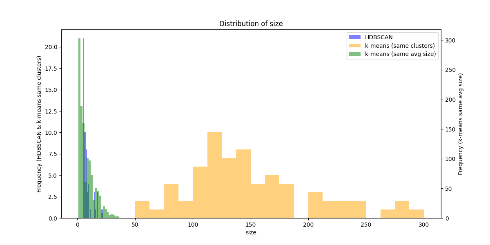

# クラスタリング手法の比較実験

## 目的
- k-meansとHDBSCANのクラスタリング結果を比較
- クラスタ数とクラスタサイズの分布を分析

## 実験手順
1. HDBSCANクラスタリングの実行
   - パラメータ: min_cluster_size=5, max_cluster_size=30, min_samples=2
   - 結果の保存: experiments/results/hdbscan_detailed_metrics.csv

2. HDBSCANの結果に基づくk-meansクラスタリング
   - 同じクラスタ数のk-means
   - 同じ平均クラスタサイズのk-means
   - 結果の保存: experiments/results/kmeans_same_n_metrics.csv, kmeans_same_size_metrics.csv

3. メトリクスの比較と可視化
   - size: クラスタサイズの分布
   - avg_distance: クラスタ内の平均距離
   - max_distance: クラスタ内の最大距離
   - density: クラスタの密度

## 実験結果

### HDBSCANクラスタリング
- クラスタ数: 66
- 平均クラスタサイズ: 8.06
- ノイズポイントの数: 9351
- 有効なデータポイント数: 532（全9883ポイント中）

### k-meansクラスタリング（同じクラスタ数）
- クラスタ数: 66
- データポイント数: 9883（ノイズポイントなし）
- 平均クラスタサイズ: 149.74（9883/66）

### k-meansクラスタリング（同じ平均サイズ）
- クラスタ数: 1226
- データポイント数: 9883（ノイズポイントなし）
- 平均クラスタサイズ: 8.06（9883/1226）

### メトリクスの比較
各メトリクスの分布をヒストグラムで可視化しました：

1. クラスタサイズの分布
   
   
   - HDBSCANは小さなクラスタ（5-22ポイント）を多く生成
   - k-means（同じクラスタ数）のクラスタサイズは50から300の範囲に分布し、平均149.7、標準偏差54.8（変動係数36.6%）
   - k-means（同じ平均サイズ）はHDBSCANに近い分布を示す

2. クラスタ内の平均距離
   
   - クラスタ内の点同士の平均距離を示す
   - 小さいほど密集したクラスタを表す

3. クラスタ内の最大距離
   
   - クラスタの直径に相当
   - 大きいほどクラスタが広がっていることを示す

4. クラスタの密度
   
   - 平均距離の逆数として定義
   - 大きいほど密集したクラスタを表す

## 考察
1. HDBSCANの特徴
   - 小さな密集したクラスタを検出
   - データの94.6%（9351/9883）をノイズとして分類
   - 残りの5.4%のデータを66の明確なクラスタに分類

2. k-means（同じクラスタ数）の特徴
   - 全データポイントを66クラスタに均等に分配
   - クラスタサイズが比較的均一
   - ノイズの概念がないため、全データポイントをいずれかのクラスタに割り当て

3. k-means（同じ平均サイズ）の特徴
   - HDBSCANの平均クラスタサイズ（8.06）に合わせて1226クラスタを生成
   - より細かい粒度でのクラスタリングを実現
   - クラスタサイズの分布がHDBSCANに近い

## 追加実験：データセットXとHDBSCANの比較分析
k=1226のデータから、サイズ5以上のクラスタを抽出し、密度の高い順に66件を選択して新しいデータセットXを作成しました。このデータセットとHDBSCANの結果を比較した結果を以下に示します：

### 実験手順
1. k=1226のデータセットから、サイズ5以上のクラスタを抽出（734件）
2. 抽出したクラスタから密度の高い順に66件を選択
3. 選択したクラスタ（データセットX）とHDBSCANの結果を比較

### 比較結果
1. メトリクス分布の比較
   

   - クラスタサイズ：両方とも小規模クラスタ（5-20程度）が中心
   - 平均距離：データセットXの方が全体的に小さい値（0.4-0.8）を示し、より密集したクラスタを形成
   - 最大距離：データセットXの方が小さい値（0.6-1.0）に集中し、コンパクトな形状を示す
   - 密度：データセットXは高密度（1.4-2.5）範囲に分布

### 考察
1. データセットXの特徴
   - k-meansの結果から高密度なクラスタのみを選択的に抽出することで、密集した明確なクラスタを得ることができた
   - HDBSCANと同様に小規模クラスタが中心となり、自然な分布を示した

2. HDBSCANとの比較
   - クラスタ数（66）は同じだが、クラスタの特性が異なる
   - データセットXの方が全体的に密度が高く、より密集したクラスタを形成
   - 両手法とも小規模で密集したクラスタを重視する点で共通

3. 手法の違い
   - HDBSCAN：自然な密度ベースのクラスタリングを実現し、ノイズ点を許容
   - データセットX：k-meansの結果から高密度クラスタを選択的に抽出し、密集度の高いクラスタのみを得る

## 結論
- HDBSCANは密集した明確なクラスタのみを抽出し、大部分のデータをノイズとして分類
- k-meansは全データポイントを指定された数のクラスタに分配
- クラスタ数とクラスタサイズのトレードオフが存在することが確認された
