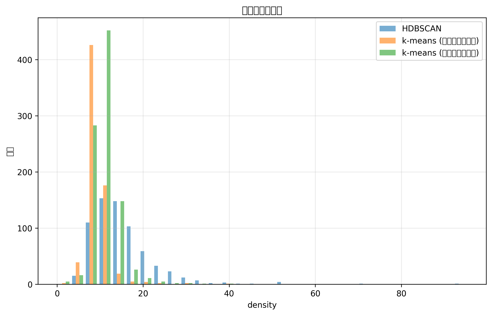

# クラスタリング手法の比較実験（2次元データ）

## 目的
- UMAPで2次元に削減したデータに対して、k-meansとHDBSCANのクラスタリング結果を比較
- クラスタ数とクラスタサイズの分布を分析

## 実験手順
1. UMAPによる次元削減
   - 入力: 9883件の3072次元ベクトル
   - 出力: 9883件の2次元ベクトル
   - パラメータ: n_components=2, random_state=42

2. HDBSCANクラスタリングの実行
   - パラメータ: min_cluster_size=5, max_cluster_size=30, min_samples=2
   - 結果の保存: experiments/results/hdbscan_detailed_metrics_2d.csv

3. HDBSCANの結果に基づくk-meansクラスタリング
   - 同じクラスタ数のk-means
   - 同じ平均クラスタサイズのk-means
   - 結果の保存: experiments/results/kmeans_same_n_metrics_2d.csv, kmeans_same_size_metrics_2d.csv

4. メトリクスの比較と可視化
   - size: クラスタサイズの分布
   - avg_distance: クラスタ内の平均距離
   - max_distance: クラスタ内の最大距離
   - density: クラスタの密度

## 実験結果

### HDBSCANクラスタリング
- クラスタ数: 676
- ノイズポイントの数: 2870
- 有効なデータポイント数: 7013（全9883ポイント中）

### k-meansクラスタリング（同じクラスタ数）
- クラスタ数: 676
- データポイント数: 9883（ノイズポイントなし）
- 平均クラスタサイズ: 14.62

### k-meansクラスタリング（同じ平均サイズ）
- クラスタ数: 952
- データポイント数: 9883（ノイズポイントなし）
- 平均クラスタサイズ: 10.38

### メトリクスの比較
各メトリクスの分布をヒストグラムで可視化しました：

1. クラスタサイズの分布
   
   - HDBSCANは小さなクラスタを多く生成
   - k-means（同じクラスタ数）は均一なサイズのクラスタを生成
   - k-means（同じ平均サイズ）はHDBSCANに近い分布を示す

2. クラスタ内の平均距離
   
   - クラスタ内の点同士の平均距離を示す
   - 小さいほど密集したクラスタを表す

3. クラスタ内の最大距離
   
   - クラスタの直径に相当
   - 大きいほどクラスタが広がっていることを示す

4. クラスタの密度
   
   - 平均距離の逆数として定義
   - 大きいほど密集したクラスタを表す

## 考察
1. HDBSCANの特徴
   - 676の明確なクラスタを検出
   - データの29.0%（2870/9883）をノイズとして分類
   - 残りの71.0%のデータを意味のあるクラスタに分類

2. k-means（同じクラスタ数）の特徴
   - 全データポイントを676クラスタに分配
   - クラスタサイズが比較的均一（平均14.62ポイント/クラスタ）
   - ノイズの概念がないため、全データポイントをいずれかのクラスタに割り当て

3. k-means（同じ平均サイズ）の特徴
   - より多くのクラスタ（952個）を生成
   - 小さなクラスタサイズ（平均10.38ポイント/クラスタ）
   - クラスタサイズの分布がHDBSCANに近い

## 結論
- 2次元データに対しても、HDBSCANは密集した明確なクラスタを抽出し、ノイズを適切に分類
- k-meansは全データポイントを指定された数のクラスタに分配
- クラスタ数とクラスタサイズのトレードオフが2次元データでも確認された
- 元の高次元データと比較して、2次元データではより多くのクラスタが検出された
