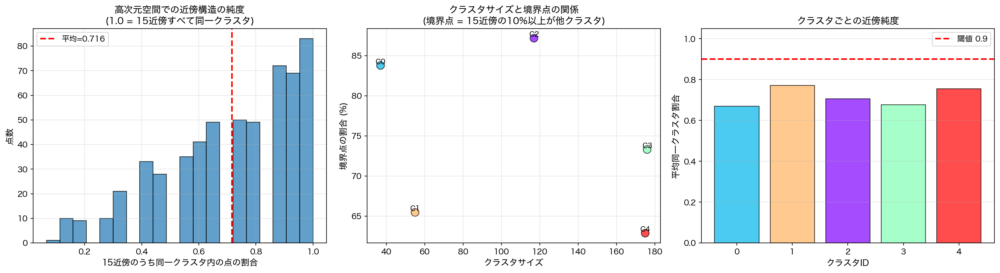

# HDBSCANとUMAPのスケールミスマッチ問題

**日付**: 2025-10-28
**実験ディレクトリ**: `experiments/2025-10-28/`
**データセット**: team-mirai (21,348点, 1536次元)

## 背景：不可解な現象

2025-10実験において、HDBSCANで抽出したクラスタをUMAPで2次元可視化したところ、以下の不可解な現象が観察された：

- HDBSCANは高次元空間で**密集した領域**をクラスタとして抽出するはず
- しかし、UMAP可視化では：
  - クラスタが**引き裂かれて**複数の場所に分散
  - 異なるクラスタが**大きくオーバーラップ**
  - 凸包（convex hull）が複雑に交差


## 疑問：UMAPは局所構造を保存するはずでは？

UMAPは**局所的な近傍構造を保存する**次元削減手法である。そのため：

> HDBSCANで抽出されたクラスタは高次元空間で密集しているはず
> → その局所構造はUMAPで2次元になる時にも尊重されるはず
> → なぜ引き裂かれたりオーバーラップするのか？

この疑問を解決するため、以下の仮説を立てた。

## 仮説：スケールのミスマッチ

UMAPが保存する「局所構造」とHDBSCANが定義する「クラスタ」は、**異なるスケール**を見ているのではないか？

- **UMAPの局所性**: `n_neighbors=15` → 各点の最近傍15点の関係を保存
- **HDBSCANのクラスタ**: `min_cluster_size=30-50` → 数十〜数百点規模の構造

もし、各点の15近傍の中に他クラスタの点が混入していれば、UMAPはその混入した関係も保存しようとするため、2次元でクラスタがオーバーラップするはずである。

## 実験1：高次元空間での近傍構造分析

### 方法

1. データをサンプリング（5,000点）
2. HDBSCAN実行（`min_cluster_size=30, min_samples=5`）
3. 各点の15近傍を高次元空間で計算
4. 15近傍のうち同一クラスタ内の点の割合を分析

### 結果

**驚くべき発見**：HDBSCANのクラスタは、高次元空間でも15近傍レベルでは純粋ではない。

| 指標 | 値 |
|------|-----|
| **平均同一クラスタ割合** | **71.6%** |
| 中央値 | 73.3% |
| 最小値 | 6.7% |
| 最大値 | 100% |
| **境界点割合** | **72.9%** |

**境界点の定義**: 15近傍の10%以上が他クラスタに属する点

#### クラスタごとの分析

| クラスタID | サイズ | 平均同一クラスタ割合 | 境界点割合 |
|-----------|--------|-------------------|-----------|
| 2 | 117 | 0.706 | 87.2% |
| 0 | 37 | 0.668 | 83.8% |
| 3 | 176 | 0.677 | 73.3% |
| 1 | 55 | 0.771 | 65.5% |
| 4 | 175 | 0.754 | 62.9% |

**すべてのクラスタで60%以上が境界点**である。



### 解釈

- 15近傍のうち**平均で約28%が他クラスタまたはノイズ点**
- クラスタ内の点の**約73%が境界点**
- → **UMAPは高次元空間の近傍構造を正しく保存している**
- → しかし、その近傍構造自体が既に複雑に混在している

## 実験2：HDBSCANのスケール分析

### 方法

複数のスケール（k=5, 10, 15, 30, 50, 100）で近傍構造の純度を分析し、HDBSCANのパラメータ（`min_samples=5`, `min_cluster_size=30`）と比較する。

### 結果

| k（近傍数） | 平均純度 | 境界点割合 | 意味 |
|------------|---------|-----------|------|
| **5** | **0.835** | **44.1%** | **HDBSCANの密度計算スケール** |
| 10 | 0.774 | 51.6% | |
| **15** | **0.716** | **72.9%** | **UMAPのスケール** |
| **30** | **0.597** | **87.7%** | **HDBSCANのクラスタサイズスケール** |
| 50 | 0.497 | 99.1% | |
| 100 | 0.351 | 100.0% | |


### 重要な発見

左上のグラフから明らかなように、**スケールが大きくなるほど純度が急激に低下**する：

- **k=5（HDBSCANの密度計算）**: 純度 83.5% → まあまあ純粋
- **k=15（UMAPのスケール）**: 純度 71.6% → 約28%が他クラスタ
- **k=30（HDBSCANのクラスタサイズ）**: 純度 59.7% → 約40%が他クラスタ

## HDBSCANが見ている多層的なスケール

HDBSCANのアルゴリズムは、複数のスケールで動作する：

### レイヤー1: 局所密度の計算（min_samples=5）

```
各点について、5番目近傍までの距離を計算
→ Core Distance（局所密度の逆数）を定義
→ このスケールでは純度 83.5%
```

### レイヤー2: 密な領域の連結

```
Minimum Spanning Treeで密度の高い領域を連結
→ 階層的にクラスタを構築
→ 小さなスケール（5近傍）での密度情報を基に、大きな構造を抽出
```

### レイヤー3: クラスタの抽出（min_cluster_size=30）

```
30点以上のまとまりをクラスタとして認識
→ 結果として、数十〜数百点規模の構造
→ しかし、このスケール（30近傍）では純度 59.7%
```

## なぜクラスタが引き裂かれるのか

### HDBSCANの視点

```
HDBSCANの内部ロジック:
  点A → 5近傍を見る → 密度を計算
  密な点同士をつなぐ → 大きなクラスタ構造を抽出

結果:
  クラスタは数百点規模の構造
  局所的（5近傍）には密だが、
  中間スケール（15近傍）では既に他クラスタと混在
```

### UMAPの視点

```
UMAPの内部ロジック:
  点A → 15近傍を見る
    同一クラスタ: 10点
    他クラスタ:   5点

  2次元配置の制約:
    「点Aと同一クラスタの10点を近くに」
    「点Aと他クラスタの5点も近くに」  ← これが問題

  物理的に全ての制約を満たせない
  → クラスタが引き裂かれたり、オーバーラップ
```

### 比喩的説明

**HDBSCANの動作**:
- 「都市」（大規模構造）を抽出
- 各区画（5近傍）は同じ都市内で密集
- しかし、都市の境界付近では隣の都市も見える（15近傍レベル）

**UMAPの動作**:
- 住民の近所づきあい（15近傍）を保存
- 境界付近の住民は隣の都市の住民も近所に含む
- 結果、2次元地図では都市の境界が曖昧になる

## 実験環境の詳細

### スクリプト

1. **`analyze_neighborhood_sampled.py`**:
   - 高次元空間での15近傍の純度分析
   - クラスタ間の近傍リンク検出
   - 境界点の特定

2. **`analyze_hdbscan_scale.py`**:
   - 複数スケール（k=5-100）での純度分析
   - HDBSCANパラメータとの対応
   - Core distance分布の可視化

### パラメータ

```python
# データ
サンプルサイズ: 5,000点（元データ: 21,348点）
次元数: 1,536

# HDBSCAN
min_cluster_size: 30
min_samples: 5
metric: 'euclidean'

# UMAP（2025-10実験）
n_neighbors: 15
min_dist: 0.1
n_components: 2
```

### 結果ファイル

```
experiments/2025-10-28/
├── analyze_neighborhood_sampled.py
├── analyze_hdbscan_scale.py
├── neighborhood_analysis_sampled.png
├── hdbscan_scale_analysis.png
└── hdbscan_labels_cache.pkl
```

## 結論

### 主要な発見

1. **HDBSCANのクラスタは高次元でも15近傍レベルでは純粋ではない**
   - 平均純度: 71.6%
   - 境界点: 72.9%

2. **HDBSCANは多層的なスケールで動作**
   - 密度計算: 5近傍（純度 83.5%）
   - クラスタ抽出: 30点以上の構造（純度 59.7%）

3. **UMAPとHDBSCANのスケールミスマッチ**
   - UMAPは15近傍の関係を保存
   - このスケールでは既にクラスタが混在（純度 71.6%）
   - 結果として、2次元でクラスタが引き裂かれる

4. **UMAPは正しく動作している**
   - 高次元空間の近傍構造を忠実に保存
   - 問題は、その近傍構造自体が複雑に混在していること

### 理論的インサイト

**当初の疑問**:
> UMAPは局所構造を保存するはず → なぜHDBSCANクラスタが引き裂かれる？

**答え**:
- UMAPは確かに局所構造（15近傍）を保存している
- しかし、HDBSCANが定義する「クラスタ」は、より小さなスケール（5近傍）での密度情報から、より大きな構造（30点以上）を抽出したもの
- **15近傍というUMAPのスケールは、この2つの中間にあり、既にクラスタが複雑に混在している領域**
- → スケールのミスマッチが可視化の歪みを生む

### 実用的な示唆

#### 問題の改善策

1. **Supervised UMAPを使用**（2025-10で検証済み）
   ```python
   UMAP(n_neighbors=15, target_weight=0.9)
   ```
   - クラスタラベルを教師信号として与える
   - 近傍構造よりもクラスタの分離を優先

2. **UMAPのn_neighborsを調整**
   - より大きな値（30-50）→ クラスタの大域構造を保存
   - より小さな値（5-10）→ HDBSCANの密度計算スケールに合わせる

3. **HDBSCANのmin_cluster_sizeを大きくする**
   - より明確に分離されたクラスタのみを抽出
   - トレードオフ: ノイズ点が増加

4. **別の次元削減手法を検討**
   - t-SNE: 局所構造に特化
   - PaCMAP: UMAPとt-SNEの中間
   - PCA: 線形だが大域構造を保存

#### 可視化時の注意点

- 通常のUMAP可視化は、クラスタの境界を正確に反映しない
- クラスタラベルを持っている場合は、Supervised UMAPを推奨
- クラスタの評価は、高次元空間での指標（シルエットスコア等）で行うべき

## 参考

### 関連実験

- `experiments/2025-10/`: 元の可視化実験（k-means, HDBSCAN, Supervised UMAP）
- `experiments/2025-10/main.py`: 複数の可視化手法の比較

### アルゴリズム

- **HDBSCAN**: Campello, R. J. G. B., Moulavi, D., & Sander, J. (2013). "Density-Based Clustering Based on Hierarchical Density Estimates"
- **UMAP**: McInnes, L., Healy, J., & Melville, J. (2018). "UMAP: Uniform Manifold Approximation and Projection for Dimension Reduction"

### 次のステップ

1. 元データ（21,348点）での完全な分析
2. 異なるmin_samplesパラメータでの比較
3. Supervised UMAPとの定量的比較
4. t-SNE, PaCMAPとの比較実験
